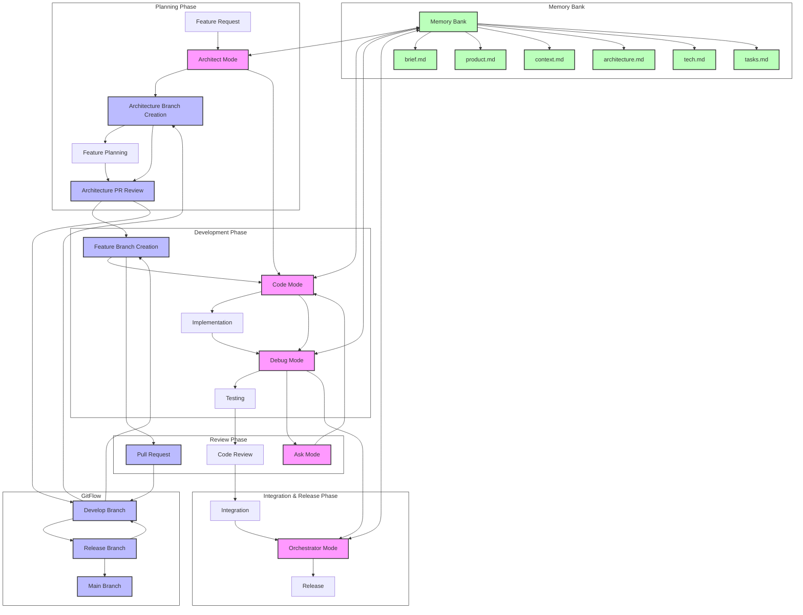
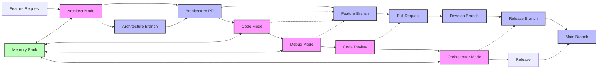

# Workflow Diagram: Kilocode Modes + Memory Bank + GitFlow

The following diagram illustrates the integrated workflow between Kilocode modes, Memory Bank, and GitFlow for feature development.

## Mermaid Diagram

## Simplified Workflow Diagram

## Key

- **Pink Boxes**: Kilocode Modes
- **Blue Boxes**: GitFlow Branches
- **Green Boxes**: Memory Bank Components
- **Solid Lines**: Direct Workflow
- **Dotted Lines**: Relationships/Interactions

This diagram illustrates how the different components interact throughout the feature development lifecycle, from initial planning through to release.